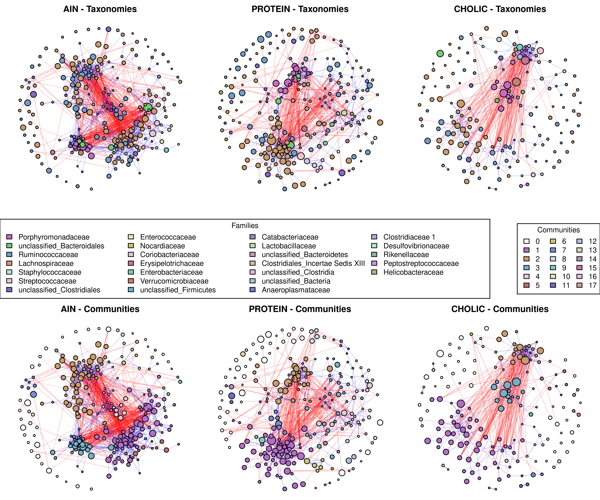
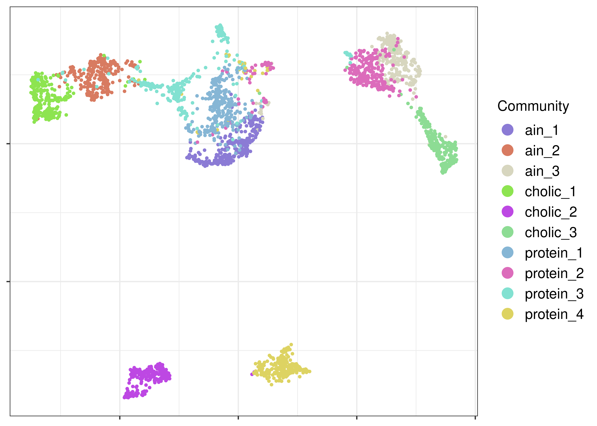

# ibdmdb-network-pathways

Exploratory analysis of bacterial community structure and metabolic pathways in the human gut microbiome, using the IBDMDB longitudinal cohort.

---

## Motivation

Standard microbiome analyses focus on which species are present and how abundant they are. This project explores a complementary question: can we identify **groups of bacteria that consistently co-occur and co-vary together** — communities in the network sense — and do these communities carry a recognisable **metabolic signature** that relates to the host's condition?

The underlying intuition is that what bacteria *do together* may be more informative than who they are individually. Different individuals can host entirely different species yet converge on similar functional states — or diverge into distinct ones.

This is a preliminary investigation. The goal is to find out whether this approach produces any signal worth following up, not to draw conclusions.

---

## Starting point: a pilot on mouse data

Before applying this to humans, the idea was tested on the **POMP dataset** — gut microbiome profiles from genetically identical mouse clones raised on three different diets: standard (AIN), high-protein (PROTEIN), and high-fat/cholate (CHOLIC).

Genetically identical animals remove host genetics as a variable, so any microbiome differences are attributable to diet alone. Bacterial co-occurrence networks were reconstructed from 16S OTU data for each diet group, communities were detected within each network, and metabolic pathways were predicted with **PICRUSt2**.

### Networks and communities

The panels below show the co-occurrence networks for each diet, coloured by bacterial family (top) and by detected community (bottom). Red edges indicate positive co-occurrence, blue edges negative. Node size reflects abundance.

<p align="center">
  
</p>

### Metabolic profiles: a PacMAP projection

Each community was represented by its vector of predicted pathway abundances, and all communities across all diets were projected into two dimensions using PacMAP.

<p align="center">
  
</p>

Most communities overlap in a shared region of metabolic space. Two stand apart: **`cholic_2`** and **`protein_4`** are completely separated from all others, each associated with a specific diet. Whether this reflects something biologically meaningful or is an artefact of the small dataset is one of the things this project aims to clarify in a larger human cohort.

---

## Extension to humans: the IBDMDB cohort

This repository contains the analysis pipeline for applying the same framework to the **IBDMDB (Inflammatory Bowel Disease Multi-omics Database)** cohort — 416 shotgun metagenomic samples from 27 subjects (Crohn's disease, ulcerative colitis, and healthy controls) collected longitudinally.

Human data is considerably noisier than the mouse pilot: host genetics, age, sex, lifestyle, and medication all vary. The inter-individual effect is large. The question is whether any disease-associated community structure survives that noise.

### Why MetaPhlAn and HUMAnN

The pipeline uses **MetaPhlAn 4** for taxonomic profiling and **HUMAnN 4** for pathway abundance estimation because both tools work directly from raw reads against reference databases, without requiring assembly or other computationally intensive steps. This makes them a practical choice for a first exploratory pass: the priority here is to obtain a reasonable signal quickly, not to extract every last bit of information from the data.

### Analysis strategy

1. Quality filtering and host read removal with KneadData.
2. Species-level taxonomic profiling with MetaPhlAn 4.
3. Per-subject co-occurrence networks inferred from each patient's longitudinal time series.
4. Community detection within each network.
5. Metabolic characterisation using HUMAnN 4 stratified pathway abundances, which attribute pathway contributions to individual species.
6. Comparison of community metabolic profiles across subjects, looking for recurring patterns associated with disease status.
7. Statistical testing with mixed models to account for the subject effect.

---

## Repository structure

```
ibdmdb-network-pathways/
├── data/
│   └── metadata_ena_sra/         # Sample metadata (SRA accession PRJNA398089)
├── workflow/
│   ├── rules/                    # Snakemake rules (download, QC, MetaPhlAn, HUMAnN)
│   ├── scripts/                  # R scripts for post-processing
│   └── config/                   # Pipeline configuration
├── results/
│   ├── metaphlan/                # Species abundance and taxonomy matrices
│   └── humann_metabolic_pathway_abundance_long.tsv.gz
├── analysis/
│   └── metaphlan_species_exploration/
└── figures/
```

---

## Reproducibility

Pipeline implemented in Snakemake, run on an HPC cluster (SLURM profile included). All tools run in Singularity containers. Raw reads are downloaded from ENA/SRA automatically.

```bash
snakemake --profile workflow/profiles/slurm --use-singularity
```

---

## License

MIT — see [LICENSE](LICENSE).
